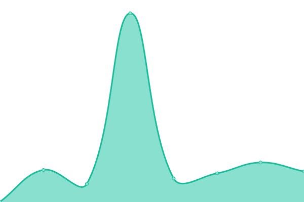

# [📈 Live Status](https://demo.upptime.js.org): <!--live status--> **🟩 All systems operational**

This repository contains the open-source uptime monitor and status page for [Upptime](https://upptime.js.org), powered by [Upptime](https://github.com/upptime/upptime).

With [Upptime](https://upptime.js.org), you can get your own unlimited and free uptime monitor and status page, powered entirely by a GitHub repository. We use [Issues](https://github.com/upptime/upptime/issues) as incident reports, [Actions](https://github.com/MadeMediaCorp/system-status/actions) as uptime monitors, and [Pages](https://demo.upptime.js.org) for the status page.

<!--start: status pages-->
<!-- This summary is generated by Upptime (https://github.com/upptime/upptime) -->
<!-- Do not edit this manually, your changes will be overwritten -->
<!-- prettier-ignore -->
| URL | Status | History | Response Time | Uptime |
| --- | ------ | ------- | ------------- | ------ |
|  App | 🟩 Up | [app.yml](https://github.com/MadeMediaCorp/system-status/commits/HEAD/history/app.yml) | 

 117ms
     
 | 

<a href="https://status.onboardapp.co/history/app">100.00%</a>
    

|  Portal | 🟩 Up | [portal.yml](https://github.com/MadeMediaCorp/system-status/commits/HEAD/history/portal.yml) | 

 181ms
     
 | 

<a href="https://status.onboardapp.co/history/portal">100.00%</a>
    

|  API | 🟩 Up | [api.yml](https://github.com/MadeMediaCorp/system-status/commits/HEAD/history/api.yml) | 

 197ms
     
 | 

<a href="https://status.onboardapp.co/history/api">100.00%</a>
    

|  [Self-Complete](https://complete.onboardapp.co/en.html) | 🟩 Up | [self-complete.yml](https://github.com/MadeMediaCorp/system-status/commits/HEAD/history/self-complete.yml) | 

 370ms
     
 | 

<a href="https://status.onboardapp.co/history/self-complete">100.00%</a>
    

|  [Mademedia Website](https://mademedia.tech) | 🟩 Up | [mademedia-website.yml](https://github.com/MadeMediaCorp/system-status/commits/HEAD/history/mademedia-website.yml) | 

 104ms
     
 | 

<a href="https://status.onboardapp.co/history/mademedia-website">100.00%</a>
    

|  [Onboard Website](https://onboardapp.co) | 🟩 Up | [onboard-website.yml](https://github.com/MadeMediaCorp/system-status/commits/HEAD/history/onboard-website.yml) | 

 111ms
     
 | 

<a href="https://status.onboardapp.co/history/onboard-website">100.00%</a>
    

<!--end: status pages-->

[**Visit our status website →**](https://demo.upptime.js.org)

## 📄 License

- Powered by: [Upptime](https://github.com/upptime/upptime)
- Code: [MIT](./LICENSE) © [Anand Chowdhary](https://anandchowdhary.com), supported by [Pabio](https://pabio.com)
- Data in the `./history` directory: [Open Database License](https://opendatacommons.org/licenses/odbl/1-0/)
